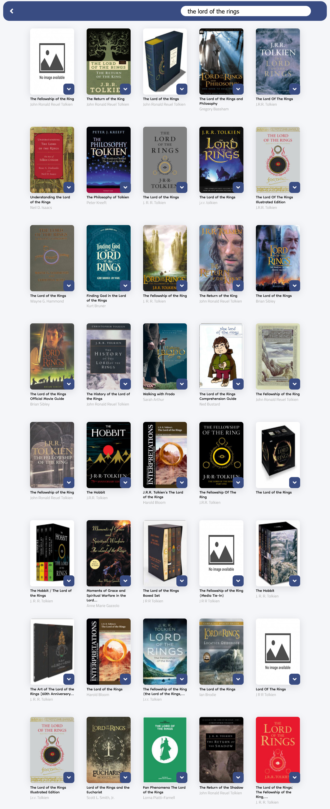

To start the application:
```shell
# Install dependencies.
$ npm install
# Start the application
$ npm start
```

Open [http://localhost:3000](http://localhost:3000) to view it in your browser.




