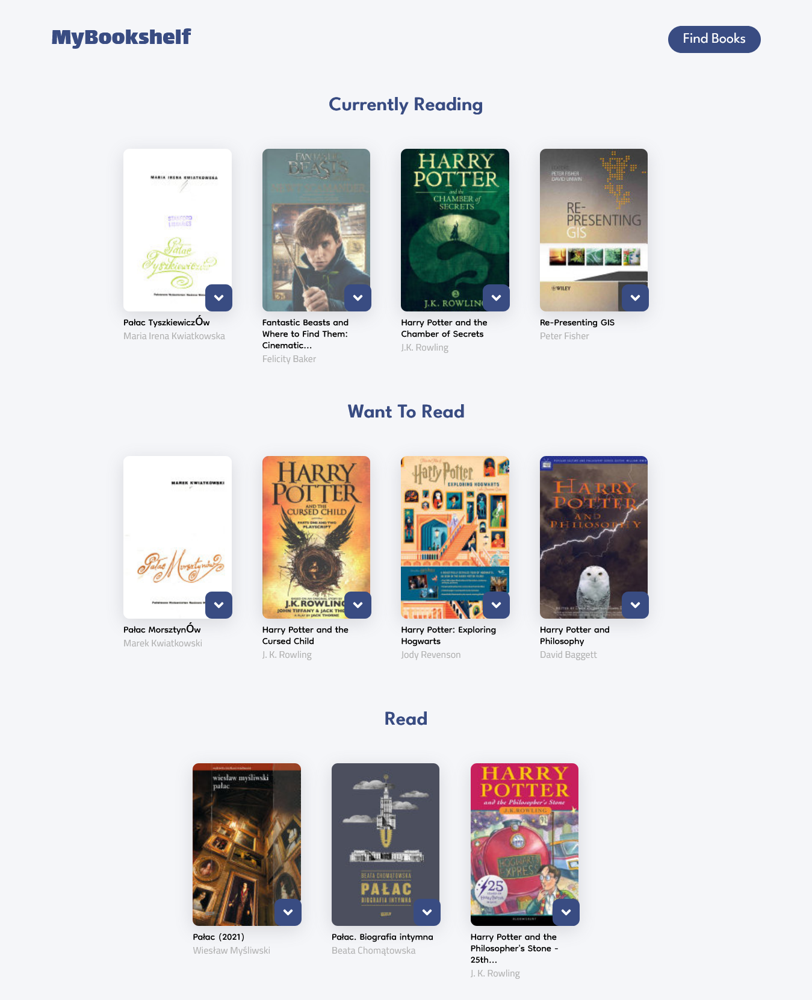

# Bookshelf App (React App)
## Udacity Capstone project 

###Technologies used: React, Google Books API, Framer Motion, React Router

Bookshelf is a react app where users can find books and sort them between different shelves. 


To start the application:
```shell
# Install dependencies.
$ npm install
# Start the application
$ npm start
```

Open [http://localhost:3000](http://localhost:3000) to view it in your browser.




